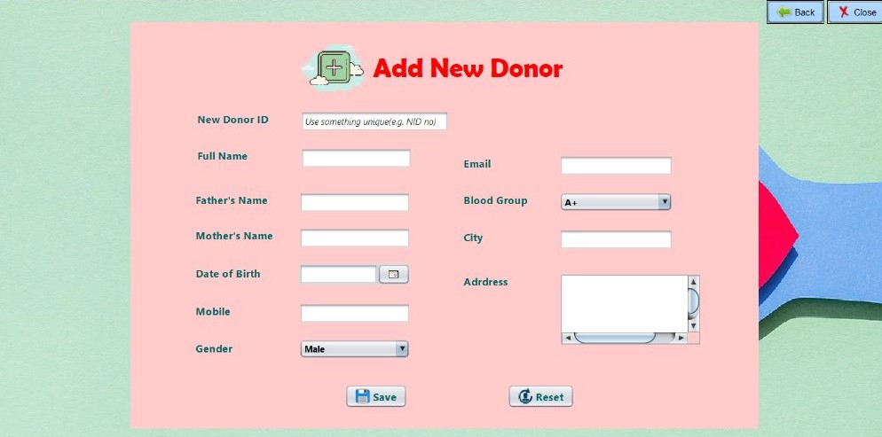

# Blood Bank Management System

## Introduction
This project, created in 2022, using Java. Unfortunately, the source code is no longer available, but the user interface designs remain and demonstrate the project's core functionality and design principles.

The **Blood Bank Management System** is a comprehensive application for managing blood donation and stock details. It enables users to add, update, and delete donor records, search for donors based on location or blood group, and manage blood stock efficiently. The system's user-friendly interface ensures seamless navigation for hospital staff and administrators.

## Features

- **Donor Management**:
  - Add new donors and store their details.
  - Update donor details as required.
  - Delete donor records when no longer needed.

- **Search Functionality**:
  - Locate donors by blood group.
  - Find donors based on their location.

- **Blood Stock Management**:
  - View current blood stock details.
  - Increase or decrease stock based on requirements.

- **Reporting**:
  - Print donor and stock details for administrative purposes.

- **Graphical User Interface**:
  - Easy-to-use menus for performing various operations.

## Workflow

- **Donor Management**:
   - Add or update donor details, including their blood group, location, and contact information.
   - Delete donor records when necessary.

- **Search Functionality**:
   - Search donors by blood group for quick access.
   - Search by location to find nearby donors.

- **Stock Management**:
   - Increase stock after blood donation.
   - Decrease stock after blood issuance.

- **Reporting**:
   - Generate printable reports for donors and stock details.

## Installation

- **Install Java Netbeans and Run**

### Prerequisites

- Java Development Kit (JDK) 8 or above
- MySQL Database
- Java Swing (for GUI development)

### Project UI

- **Admin Panel**

  
    
  
     
    <em>Fig 1: Starting Window </em>

  
    
  
     
    <em>Fig 2: Admin Login </em>

  
    
  
     
    <em>Fig 3: Admin Interface </em>

  
    
  
     
    <em>Fig 4: Add New Donor </em>

  
    
  
     
    <em>Fig 5: Update Donor List </em>

  
    
  
     
    <em>Fig 6: All Donor List </em>

  
    
  
     
    <em>Fig 7: Search By Address </em>

  
    
  
     
    <em>Fig 8: Blood Stock Increase </em>

  
    
  
     
    <em>Fig 9: Blood Stock Decrease </em>

  
    
  
     
    <em>Fig 10: Blood Stock Details </em>

  
    
  
     
    <em>Fig 11: Delete Donor </em>

  
    
  
     
    <em>Fig 12: All Donor List </em>

  
    
  
     
    <em>Fig 13: Emergency Fund </em>

- **User Panel**

  
    
  
     
    <em>Fig 14: User Login </em>

  
    
  
     
    <em>Fig 15: User Registration </em>

  
    
  
     
    <em>Fig 16: User Interface </em>

  
    
  
     
    <em>Fig 17: Emergency Blood Request </em>

  
    
  
     
    <em>Fig 18: User Profile Update </em>

